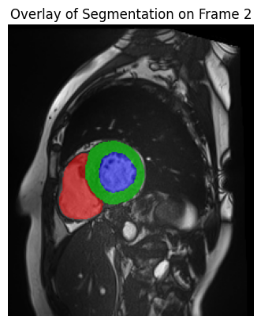

# pathology_detection

This repository presents my solution to the Kaggle Challenge on [Cardiac Pathology Prediction](https://www.kaggle.com/competitions/ima-205-challenge-2025/leaderboard), which aims to classify patient health status (healthy/ill), and identify the most probable pathology. My approach synthesizes current literature through a methodological interpolation of existing techniques, followed by qualitative analysis of the implemented solution. I managed to rank 2nd out of more than 70 students of Télécom Paris for this challenge which was given during a course.

The goal was to predict cardiac pathologies given MRIs of different patients and some data like Height and Weight.

